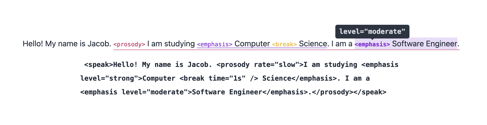

# XML Svelte

This is a Svelte component for editing / viewing XML in the browser.

## Features

- Headless, works with any CSS framework (e.g. Bootstrap, Tailwind, etc.)
- Lazy loading, fetches tag components on demand

## Example

See [src/routes/+page.svelte](src/routes/+page.svelte) for an example of how to use the component to view and edit SSML (Speech Synthesis Markup Language, an XML dialect).



```svelte
<script lang="ts">
    import { XML } from 'xml-svelte';

    let xml = '<speak> ... </speak>';
    let result = xml;

    const render = {
        speak: () => import('$lib/ssml/speak.svelte'),
        emphasis: () => import('$lib/ssml/emphasis.svelte'),
        prosody: () => import('$lib/ssml/prosody.svelte'),
        break: () => import('$lib/ssml/break.svelte'),
        '#text': () => import('$lib/ssml/content.svelte')
    };

    let editor: XML;

    function update() {
        const out = editor.result();
        if (out) {
            result = out;
        } else {
            result = 'Invalid XML';
        }
    }
</script>

<div>
    <XML bind:this={editor} {xml} {render} on:change={update} />
    <div><code>{result}</code></div>
</div>
```
